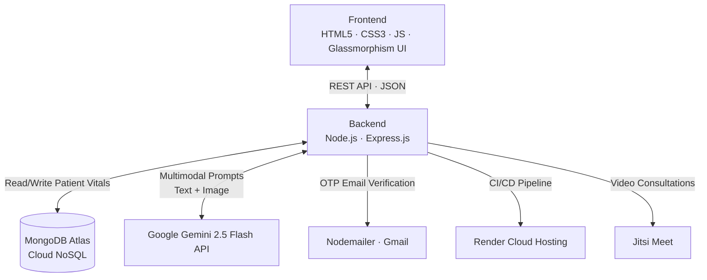

# 🏥 NextStep-Care
### *Smart Recovery. Stronger Tomorrow.*

<p align="center">
  <b>An AI-powered post-hospital recovery ecosystem that bridges the dangerous gap between hospital discharge and full recovery — using a custom predictive triage algorithm, multimodal AI, and real-time vitals monitoring.</b>
</p>

<p align="center">
  <a href="https://nextstep-care-fullstack.onrender.com"></a>
  <a href="https://youtu.be/UNxHK7_8D1s?si=2BAXlxT3dL9f1OFK"></a>
  <a href="https://github.com/anirudh-ydv/NextStep-Care-Fullstack"></a>
</p>

---

## 🚨 The Problem: The Silent Crisis After Discharge

Every year, millions of patients leave hospitals with complex recovery instructions — but without continuous monitoring or real support.

This creates a dangerous **"30-Day Recovery Gap"** where:

- Patients ignore early warning signs of deterioration
- Medication adherence drops drastically without reminders
- Doctors lose visibility the moment patients walk out
- Preventable complications escalate into emergency readmissions

**Nearly 20% of patients are readmitted within 30 days. Most of these readmissions are preventable.**

---

## 💡 The Solution: NextStep-Care

NextStep-Care is a **full-stack AI-powered healthcare platform** that transforms post-hospital recovery from a reactive process into a proactive digital care system — extending medical supervision directly into the patient's home.

| For Doctors | For Patients |
|---|---|
| Monitor all discharged patients in one dashboard | Log vitals daily with a simple interface |
| AI Predictive Triage with risk scoring | 24/7 AI medical assistant (MediBuddy) |
| One-click Jitsi telemedicine sessions | Upload symptom images for AI visual analysis |
| Schedule appointments with auto-notifications | View recovery trends via interactive charts |
| Detect abnormal vitals trends early | Emergency SOS escalation |

---

## ⚙️ The Algorithm — Predictive Clinical Triage

> **This is the core technical innovation of NextStep-Care.**  
> Algorithmic excellence — here is exactly how ours works.

**Type:** Weighted Multi-Parameter Risk Scoring with Linear Trend Detection (OLS Regression)  
**Time Complexity:** O(n) — single pass over vitals history  
**Space Complexity:** O(1) — no auxiliary data structures allocated

---

### Step 1 — Normalise Each Vital · O(1) per vital

Each raw reading is mapped to a **danger score between 0.0 and 1.0** using piecewise linear scaling against clinical reference ranges:

```
0.0  ──  Safe zone     (within normal clinical bounds)
0.5  ──  Warning zone  (approaching dangerous boundary)
1.0  ──  Critical zone (outside safe limits entirely)
```

| Vital | critLow | safeLow | safeHigh | critHigh | Unit |
|---|---|---|---|---|---|
| Systolic BP | 70 | 90 | 130 | 180 | mmHg |
| Heart Rate | 40 | 60 | 100 | 150 | bpm |
| Blood Sugar | 50 | 70 | 140 | 300 | mg/dL |
| Hemoglobin | 6 | 11 | 17 | 20 | g/dL |

---

### Step 2 — Detect Deterioration Trend · O(n)

**Ordinary Least Squares (OLS) linear regression** runs over the patient's full vitals history to compute the slope of BP, Heart Rate, and Blood Sugar over time.

```
slope = (n·ΣXY − ΣX·ΣY) / (n·ΣX² − (ΣX)²)
```

Only **upward slopes** (worsening trends) contribute to the final risk score — a rising BP is dangerous, a falling one is recovery. The slope is clamped to [-1, +1] for consistency.

This means a patient with *borderline* current readings but a *consistently worsening trajectory* still gets flagged — catching deterioration before it becomes a crisis.

---

### Step 3 — Weighted Composite Score

| Parameter | Weight | Clinical Rationale |
|---|---|---|
| Systolic BP | **30%** | #1 predictor of cardiac events post-discharge |
| Heart Rate | **25%** | Reflects acute distress and arrhythmia risk |
| Blood Sugar | **20%** | Critical for diabetic and post-surgical patients |
| Hemoglobin | **15%** | Flags anaemia, internal bleeding, malnutrition |
| Trend Penalty | **10%** | Worsening trajectory increases risk even on borderline readings |

---

### Step 4 — Risk Classification

```
score ≥ 0.65  →  🔴 HIGH    — Immediate physician review required
score ≥ 0.35  →  🟡 MEDIUM  — Monitor closely, schedule follow-up
score  < 0.35  →  🟢 LOW     — Stable, continue routine monitoring
```

Once the algorithm produces a score, **Google Gemini 2.5 Flash** narrates the result in plain clinical English for the attending doctor — but the risk decision is always owned by the algorithm, not the AI.

---
 ## 🎨 UI/UX Philosophy
The application was designed with **Glassmorphism** and a calming blue color palette to reduce patient anxiety. The interface is highly responsive, ensuring a seamless experience whether the user is on a desktop at a clinic or a low-cost mobile device in a remote area.

## 📸 Screenshots

* **Doctor Dashboard:** 
* **Real-time Patient Vitals (Chart.js):**

---

## 🏗️ Technical Architecture



---

## 🔐 Security Architecture

- **Role-Based Access Control (RBAC)** — patients and doctors see completely separate interfaces; cross-access is blocked at both frontend and API level
- **Email OTP Verification** — no account is active until the 6-digit OTP is confirmed (10-minute expiry)
- **bcrypt Password Hashing** — salted at cost factor 10; plaintext passwords never stored
- **JWT Session Management** — stateless auth tokens; tampered tokens are cryptographically rejected
- **API Route Guards** — all patient data endpoints are protected; unauthenticated requests are blocked

---

## 🚀 Local Setup

```bash
# 1. Clone and install
git clone https://github.com/anirudh-ydv/NextStep-Care-Fullstack.git
cd NextStep-Care-Fullstack
npm install

# 2. Create a .env file in the root with:
MONGO_URI=your_mongodb_atlas_connection_string
GEMINI_API_KEY=your_google_gemini_api_key
JWT_SECRET=your_jwt_secret_key
EMAIL_USER=your_gmail_address
EMAIL_PASS=your_gmail_app_password

# 3. Start the server
node server.js
# Server runs on http://localhost:5000

# 4. Run the full test suite
npm test
```

---

## 🌍 Social Impact & SDG Alignment

### ✅ SDG 3 — Good Health & Well-being
India records 40+ million hospital discharges annually. Nearly 1 in 4 patients are readmitted within 30 days — most preventably. NextStep-Care transforms post-discharge care from *"wait until complications occur"* to *"detect deterioration early and intervene immediately."*

### ✅ SDG 10 — Reduced Inequalities
Nearly **67% of India's population lives in rural areas** where continuous medical follow-up is nearly impossible. NextStep-Care addresses this through:
- **ASHA Worker Integration** — community health workers log vitals on behalf of patients without smartphones
- **Bilingual Support** — full English and Hindi interface
- **Low-bandwidth optimisation** — functional on 3G networks

### ✅ SDG 9 — Industry, Innovation & Infrastructure
By decentralising hospital-quality monitoring into a cloud-native platform, NextStep-Care reduces physical strain on hospital infrastructure — freeing beds for critical patients while keeping recovering patients safely monitored at home.

---

## 🔭 Future Roadmap

- **IoT & Wearable Integration** — auto-sync heart rate and SpO2 from smartwatches
- **Multilingual Voice AI** — Speech-to-Text in regional Indian dialects
- **ABHA Integration** — connect with India's Ayushman Bharat Health Account system
- **Offline-First PWA** — full functionality in zero-connectivity zones
- **WhatsApp Emergency Alerts** — real-time escalation via WhatsApp Business API


---

<p align="center">
  <i>NextStep-Care — Democratising quality post-discharge care for every patient, everywhere.</i><br>
  <i>Aligned with SDG 3 · SDG 9 · SDG 10</i>
</p>
